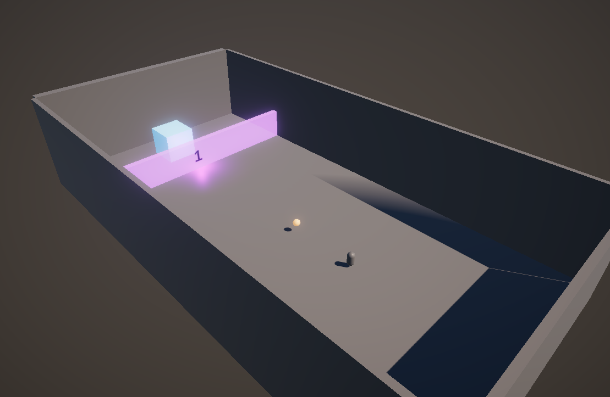

# Review Unit Tests (Arrange, Act, Assert)

Unit testing ensures each part of your game works as expected, enhancing code reliability and maintainability.

### Arrange-Act-Assert Pattern Breakdown

- **Arrange**: Set up the conditions for your test. Initialize objects, create mock data, and define expected outcomes.

- **Act**: Carry out the action you want to test. This could involve calling a method, triggering an event, or performing a calculation.

- **Assert**: Verify the results of the action. Check if the actual outcome matches the expected outcome to determine if the test passes or fails.

### `AddScore Test`

#### 1. Arrange: Setup your test objects and values.
```csharp
// Arrange
int x = 4; 
int y = 5;
int shouldBeValue = 9;
```

#### 2. Act: Perform the action you want to test.
```csharp
// Act
int sum = MathExtensions.AddScore(x, y);
```

#### 3. Assert: Check if the outcome matches expectations.
```csharp
// Assert
Assert.AreEqual(shouldBeValue, sum);
```
In this test, we verify that the `AddScore` method correctly adds two numbers.

### `AreScoresEqual Test`

#### 1. Arrange: Setup your test objects and values.
```csharp
// Arrange
int a = 100;
int b = 100;
bool expectedEqual = true;
```

#### 2. Act: Perform the action you want to test.
```csharp
// Act
bool scoresEqual = MathExtensions.IsSameScore(a, b);
```

#### 3. Assert: Check if the outcome matches expectations.
```csharp
// Assert
Assert.AreEqual(expectedEqual, scoresEqual);
```
In this test, we check that the `IsSameScore` method accurately determines if two scores are equal.

By following the Arrange-Act-Assert pattern, your unit tests will be clearer, making your game's codebase more robust and easier to maintain.
