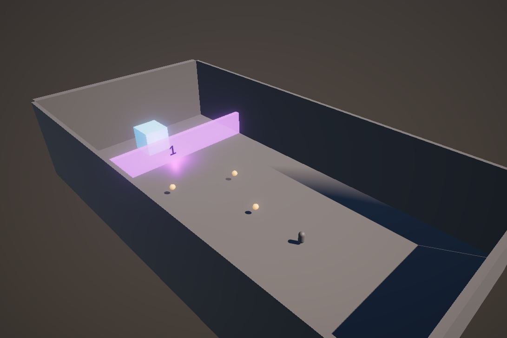

# Update Unit Test to Accomdate More Levels

[Cont. Ticket 1](https://cybersurferllc.youtrack.cloud/agiles/141-13/current?tab=chart&issue=EXTERNAL-1)

## Context:
In our previous work, we created a unit test to verify if a player could open a door based on collected items. However, this was under the assumption that the player's score needs to match the door's score exactly.

## Scenario Explanation:

Imagine a game where a door requires 5 points to open. If a player collects items worth 1, 2, and 3 points, their total score would be 6 points.

```csharp
int doorScore = 5;
int playerScore = 1 + 2 + 3; // Total: 6
```

## Problem with `==` Operator:

In the current setup, the door opens only if the player's score is exactly equal to the door's required score.

```csharp
bool canOpenDoor = playerScore == doorScore; // Returns false
```

This returns `false` because 6 is not equal to 5. As a result, the player can't open the door, even though they have more than enough points.

## Solution with `>=` Operator:

To improve the game, we want to allow the door to open as long as the player has enough points, even if they have extra. We can achieve this by changing our condition to use the `>=` operator.

```csharp
bool canOpenDoor = playerScore >= doorScore; // Returns true
```

With this change, the door will open, providing a more flexible and enjoyable experience for the player.
