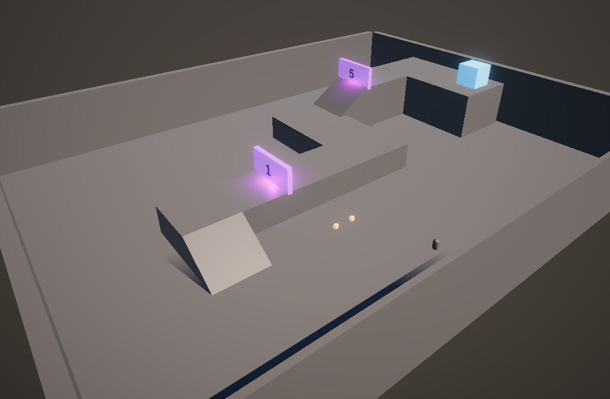

# Validating Player Progression with Multiple Doors

## Introduction
In this sample scene, we are conducting tests to ensure that a player can navigate through a level with multiple doors, each requiring a certain score to pass.

## Test Scenarios

### 1. Testing Score Subtraction with Multiple Doors: SubtractMultipleDoors_FromPlayer
This test checks if the player's score is correctly updated after subtracting the scores required to pass through multiple doors.

```csharp
[Test]
public void SubtractMultipleDoors_FromPlayer()
{
    // Arrange
    Player player = CreateTestObject<Player>("Player");
    Door door1 = CreateTestObject<Door>("Door1");
    Door door2 = CreateTestObject<Door>("Door2");
    int expectedScore = 10;

    // Act
    player.AddScore(100);
    player.SubtractScore(door1.Score + 60);
    player.SubtractScore(door2.Score + 30);

    // Assert
    Assert.AreEqual(expectedScore, player.Score, "Player's score after passing doors is incorrect");
}
```

### 2. Verifying Level Completion: `CanPlayer_CompleteLevel`
This test ensures that a player has collected enough items to surpass the required scores of all doors in the level.

```csharp
[Test]
public void CanPlayer_CompleteLevel()
{
    // Arrange
    Player player = Object.FindObjectOfType<Player>();
    Level level = Object.FindObjectOfType<Level>();

    Assert.IsNotNull(player, "Player not found in scene");
    Assert.IsNotNull(level, "Level not found in scene");

    // Collect items and open doors
    Item[] items = Object.FindObjectsOfType<Item>();
    foreach (var item in items)
    {
      player.AddScore(item.Score);  
    } 
    Door[] doors = Object.FindObjectsOfType<Door>();
    Assert.IsNotNull(doors, "Doors not found in scene");
    foreach (var door in doors)
    {
        player.SubtractScore(door.Score);
    } 

    // Act & Assert
    bool canCompleteLevel = player.Score >= 0;
    Assert.IsTrue(canCompleteLevel, "Player cannot complete the level");
}
```

## Update on Previous Tests
We have previously implemented a test `CanPlayerGetThroughDoor` to check if a player can pass through a single door. However, as our game has evolved to include multiple doors in a level, this test has become redundant. 

The test scenarios above account for multiple doors, rendering `CanPlayerGetThroughDoor` unnecessary. It is advised to remove this test to streamline the testing suite.

## Conclusion
By implementing these tests, we ensure that:

The player can complete a level by collecting enough items to offset the scores required by all doors.
The player's score is correctly updated after passing through each door.