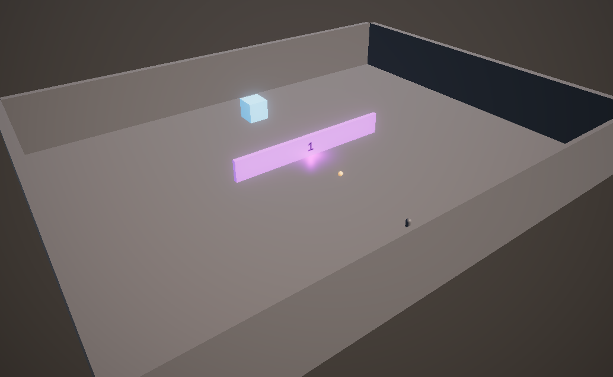

# Final Challenge: Craft Your Own Level!

## Overview

You've acquired the skills; now it's time to create your own level. With items, doors, and a player, construct a unique scene. Remember the techniques and ensure all tests pass.

## Task

1. **Design Your Level**: Utilize Unity to create a unique gameplay experience. Incorporate the player, various items, and multiple doors.

2. **Implement Logic**: Ensure interactions and score calculations work seamlessly.

3. **Test Your Level**: Run unit tests to validate gameplay elements and interactions. All tests should pass, confirming your level's integrity.

## Guidelines

- **Creativity is Key**: Let your imagination run wild, but keep your gameplay elements testable.
- **Reflect**: Consider how unit testing enhances your game development, and think about potential future adjustments.

## Conclusion

This is your moment to shine. Apply your knowledge, test thoroughly, and most importantly, have fun crafting your adventure!
