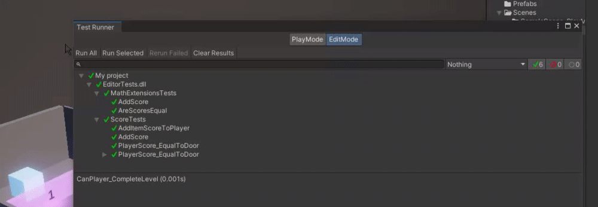

# Introduction
This is an example project outling basic QA testing in Unity

Requires Unity `2019.2` or higher

## Installing the Test Runner Package in Unity
(project already contains Unity's Test Framework Package, not required)

- **Open Unity Package Manager**: Navigate to `Window` > `Package Manager` in the Unity Editor.
- **Install Unity Test Framework**: Find and select "Unity Test Framework" from the package list, then click "Install."
- **Learn basic setup of Test Assemblies**: Unity's documentation is great on this topic. [See More](https://docs.unity3d.com/Packages/com.unity.test-framework@1.1/manual/getting-started.html)

## Running Unit Tests
1. Navigate to `Window` > `General` > `Test Runner` to open the `Test Runner` window.
2. Ensure all unit tests are listed.
3. Select and run the tests using the `Run All` button or run individual tests with the `Run` button beside each test.

## Editor vs Play Mode Tests
- **Editor Tests**: Run in the Unity Editor.
  - Example: `MathExtensions.cs` tests are editor tests. They test basic math functions used in the application, independent of the game's runtime state.
  - Example: `SceneTests.cs` tests components and interactions within a current scene.
- **Play Mode Tests**: Run while the game is playing.
  - Example: `PlayModeTests.cs` contain tests that load a scene and test functionality while the game is playing.

## Example Game Overview
We will be working on a genre-defining Item Collection Adventure game. In this game, players must collect various items to pass-through doors, and reaching the end of the level.

## Scenes to Explore

Each link below leads to a sample scene exploring various topics, accompanied by corresponding tickets in our issue tracker to exemplify a real-world workflow and provide additional context and details.

- [Scene 1: Review Unit Tests (Arrange, Act, Assert)](./Assets/Scenes/SampleScene1/README.md)
  - [Ticket 1](https://cybersurferllc.youtrack.cloud/agiles/141-13/current?tab=chart&issue=EXTERNAL-2)
- [Scene 2: Testing Player-Item Interaction and Door Accessibility](./Assets/Scenes/SampleScene2/README.md)
  - [Cont. Ticket 1](https://cybersurferllc.youtrack.cloud/agiles/141-13/current?tab=chart&issue=EXTERNAL-2)
- [Scene 3: Update Unit Test to Accomdate More Levels](./Assets/Scenes/SampleScene3/README.md)
  - [Cont. Ticket 1](https://cybersurferllc.youtrack.cloud/agiles/141-13/current?tab=chart&issue=EXTERNAL-2)
- [Scene 4: Debugging and Resolving Unit Test Failures](./Assets/Scenes/SampleScene4/README.md)
  - [Ticket 2](https://cybersurferllc.youtrack.cloud/agiles/141-13/current?tab=chart&issue=EXTERNAL-3)
- [Scene 5: Implementing and Testing Score Subtraction](./Assets/Scenes/SampleScene4/README.md)
  - [Ticket 3](https://cybersurferllc.youtrack.cloud/agiles/141-13/current?tab=chart&issue=EXTERNAL-4)
- [Scene 6: Validating Player Progression with Multiple Doors](./Assets/Scenes/SampleScene5/README.md)
  - [Cont. Ticket 3](https://cybersurferllc.youtrack.cloud/agiles/141-13/current?tab=chart&issue=EXTERNAL-5)
- [Scene 7: Validating Player Progression with Multiple Doors](./Assets/Scenes/SampleScene5/README.md)
  - [Ticket 4](https://cybersurferllc.youtrack.cloud/agiles/141-13/current?tab=chart&issue=EXTERNAL-5)
- [Scene Play-Mode: Review Unit Tests in PlayMode](./Assets/Scenes/SampleScene-PlayMode/README.md)

### Tools and Resources
- All the game code is available on [GitHub](https://github.com/CalebVaccaro/QAEventExample/).
- [Unity Test Framework](https://docs.unity3d.com/Packages/com.unity.test-framework@1.1/manual/getting-started.html)